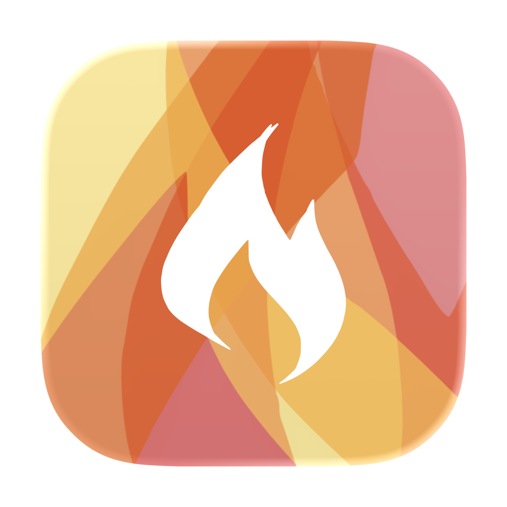

<div align="center">

<picture>
  <source media="(prefers-color-scheme: dark)" srcset="assets/images/ocak-icon-dark@2x.png">
  
</picture>

# Ocak

**A slide-out terminal drawer for managing AI coding terminals on macOS.**


</div>

---

Ocak lives in your menu bar and hides a terminal drawer just off the right edge of your screen. Pull it out with a keystroke or a nudge of the mouse, run Claude Code, OpenCode, or whatever shell you want, and let Ocak track what each terminal is doing in the background.

## Installation

Grab the latest build from the [releases page](https://github.com/bgultekin/ocak/releases/latest):

1. Download `Ocak.dmg` from the latest release.
2. Open it and drag `Ocak.app` into `/Applications`.
3. Launch it. Ocak runs as a menu bar accessory — look for the icon in the top-right of your screen.

Requires macOS 14 (Sonoma) or newer. Prefer to build it yourself? See [Build from source](#build-from-source) below.

## Features

### Slide-out drawer

The drawer tucks away on the right edge of your screen and glides in when you want it. No dock icon, no main window — it stays out of sight until you reach for it, and gets out of the way the moment you click somewhere else.

### Edge reveal

A slim ribbon hugs the right edge of the display. Push the cursor against it and the drawer opens. Pick the look that suits you: a **solid** bar, an animated **smoke** effect, an **invisible** hover zone, or **none** at all if you'd rather only use the shortcut.

### Real terminals

Every terminal is the real thing, not a chat box. Colors, mouse support, fancy keybindings, fullscreen apps like `vim` or `htop` — all of it works the way you'd expect.

### Terminal groups

Organize work into named folders tied to a project directory. Each group holds several terminals, and every terminal keeps its state as you jump between them.

### Per-group setup

Give each group its own name, working directory, and an initial command that runs automatically when you spin up a new terminal in it — perfect for kicking off `claude`, `opencode`, or a dev server without retyping.

### Live status on every terminal

When an AI coding terminal is busy, waiting for your input, or finished, the row in the sidebar reflects it. You can see at a glance which terminal needs you without opening each one.

### Git at a glance

Each terminal row shows the current branch and whether the working directory is clean, so you always know where you stand before running a command.

### Multi-screen friendly

Pick which display the drawer opens on, and Ocak remembers how wide you like it on each one. Moving between an external monitor and a laptop screen doesn't squash the layout.

### Theming

Independent controls for the app's appearance and the terminal's colors. Separate light and dark palettes, with an app icon that follows your system mode.

### Your shortcut, your rules

Default is `Cmd+Option+O`, but you can bind it to whatever combination fits your muscle memory.

### One-click setup

Turn on status tracking from the settings pane with a single click. No config files to hand-edit.

### Auto start at login

Flip a switch in settings and Ocak launches itself when you log in, ready in the menu bar before you need it.

## Getting Started

### Requirements

- macOS 14 (Sonoma) or newer
- Swift 5.9+ toolchain (Xcode 15 or the command-line tools)

### Build from source

```bash
git clone https://github.com/bgultekin/ocak.git
cd ocak/macos
swift build -c release
swift run -c release
```

Dependencies resolve automatically through Swift Package Manager.

### Run tests

```bash
swift test
swift test --filter OcakTests.HookInstallerTests
```

Tests are written against [Swift Testing](https://developer.apple.com/xcode/swift-testing/), not XCTest.

## Usage

1. Launch Ocak. It runs as a menu bar accessory — there is no dock icon.
2. Press `Cmd+Option+O`, or push the cursor against the right edge of the screen, to open the drawer.
3. Create a group pointing at a project directory.
4. Add a terminal inside the group and run `claude` (or `opencode`, or anything else you like).
5. Watch the status indicators in the terminal list flip between **working**, **needs input**, and **done** as Claude runs.

Install the Claude Code plugin from the **Plugin** tab in settings if you want the status tracking to light up.

## Architecture at a glance

```
AppDelegate ── orchestrates panels, shortcut, hook server
    │
    ├── FloatingPanel     edge ribbon, always visible
    ├── DrawerPanel       slide-in, anchored to screen edge
    │       └── DrawerView
    │               ├── SessionListView
    │               └── TerminalPaneView (SwiftTerm)
    │
    ├── HookServer        TCP 27832, receives Claude Code events
    ├── ProcessWatcher    2s sysctl poll for running claude
    └── SessionStore      @Observable, persists to UserDefaults
```

For a full breakdown of modules, stores, and conventions, see [`AGENTS.md`](AGENTS.md).

## Roadmap

- Windows client (will be living under `windows/`)
- Linux support under consideration
- Support for other coding agents beyond Claude Code and OpenCode

## Acknowledgements

- [SwiftTerm](https://github.com/migueldeicaza/SwiftTerm) by Miguel de Icaza — the terminal emulator that makes the drawer useful.
- [KeyboardShortcuts](https://github.com/sindresorhus/KeyboardShortcuts) by Sindre Sorhus — global shortcut handling.

## License

Ocak is released under the [MIT License](LICENSE).
